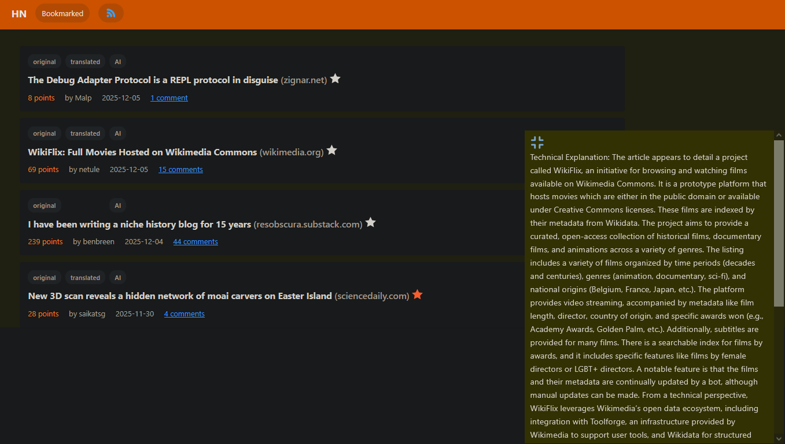
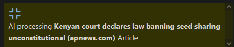
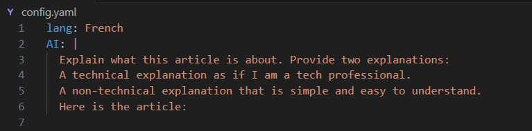
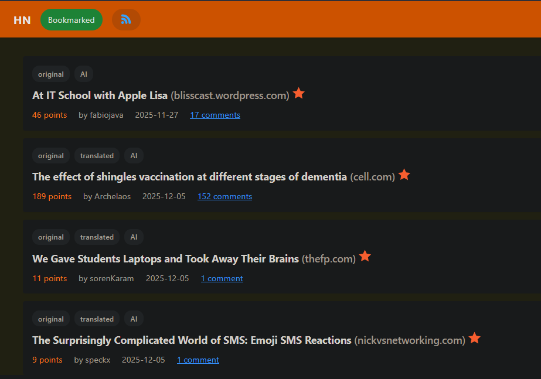
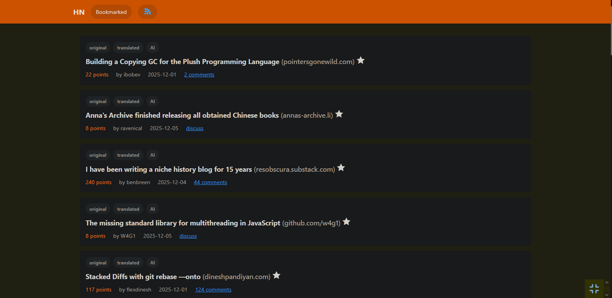
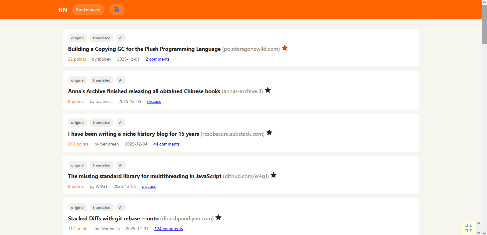

# Hcknews

Hcknews is a lightweight tool that fetches Hacker News articles and presents them through a local web UI. On each refresh the tool advances to the next Hacker News page (it fetches the first three pages only). Each article is saved as a standalone page with a direct link, can be translated into a chosen language, and can be summarized on demand using an AI summarizer. You can also bookmark articles to return to them later.

Hcknews is designed to save time and make technical content more accessible to non-experts by providing translations and simple AI-generated summaries.

## Key features

- Fetches Hacker News articles and paginates on refresh (first 3 pages only).
- Saves articles as standalone pages with direct links.
- Translates articles into a target language you configure.
- Generates AI-powered summaries of articles using a configurable prompt.
- Bookmark articles to build a personal reading list.
- Local web interface served at http://localhost:3500 by default.
- Simple extraction + run workflow (CLI/shortcut provided).

## Screenshots

- Home page — initial UI served on http://localhost:3500  
  

- During AI processing of an article (the AI prompt is configurable in `config.yaml` > `AI`)  
  

- Changing the AI prompt and the target translation language (configurable)  
  

- Additional screen  
  

- Additional screen  
  

- Additional screen  
  

- Additional screen  
  

## Installation

1. Download the project's `.7z` archive.
2. Extract the `.7z` archive to a folder.
3. Add the extracted `hcknews` folder path to your `envPath`.
   - This allows launching the application by typing `hcknews` in a Command Prompt.
4. Open Command Prompt (CMD) and run:
   - `hcknews`
   - On first run the tool will download any required dependencies and keep the CMD window open so you can follow status and logs.
5. Alternatively, run the provided `hcknews.bat` shortcut.

Notes:
- Internet access is required to fetch Hacker News content and to use any AI services the app relies on.
- Default local web UI address: http://localhost:3500

## Configuration

- Edit `config.yaml` to adjust:
  - AI prompt and summarization behavior (under `AI`).
  - Target translation language.
  - Any other runtime or UI settings exposed in the file.

Recommended changes:
- Customize the AI prompt to fit the desired summary length, tone, and level of technical detail.
- Set the preferred translation target language to ensure translated articles match your audience.

## Usage

1. Launch the application (`hcknews` or run `hcknews.bat`).
2. Open your browser and go to: http://localhost:3500
3. Use the UI to:
   - Browse saved articles with direct links.
   - Translate an article into your chosen language.
   - Request an AI summary for an article (the result appears immediately).
   - Bookmark articles to save them for later.
4. Refresh the UI to load the next Hacker News page (the tool cycles through the first 3 pages).

## How Hcknews helps

- Saves time by surfacing summaries of longer articles.
- Makes technical content more approachable for non-experts by translating and simplifying terms into the reader’s preferred language.
- Enables quick review and bookmarking of important articles.

## Contributing

Contributions are welcome. Please open an issue for bugs or feature requests, and submit pull requests for changes you want to contribute back to the project.

## Contact

itsaslpal@gmail.com
